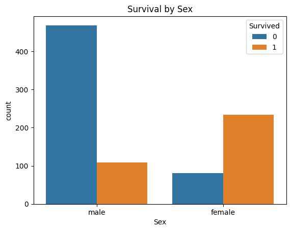

# 🚢 Titanic Machine Learning Classification

A complete Machine Learning classification project to predict Titanic passenger survival using Python and scikit-learn.

The project includes data visualization, preprocessing, feature engineering, model comparison, evaluation, and Kaggle-ready submission creation.

---

## Project Objective

The goal of this project is to predict whether a passenger survived the Titanic disaster.

The target variable is:

- `Survived = 0` → Did not survive
- `Survived = 1` → Survived

The project follows a simple CRISP-DM style workflow:

**Business Understanding → Data Understanding → Data Preparation → Modeling → Evaluation → Kaggle Submission**

---

## Dataset

The project uses two Titanic datasets:

- `ttrain.csv` → training dataset including the `Survived` target
- `ttest.csv` → test dataset without the target variable

The final test dataset contains **418 passengers**.

---

## Data Visualization

The project includes visual analysis of:

- Survival distribution
- Survival by sex
- Survival by passenger class
- Age distribution by survival

### Survival by Sex



---

## Data Preparation

The preprocessing steps include:

- Missing value analysis
- Filling missing `Age` values with the median
- Filling missing `Fare` values with the median
- Filling missing `Embarked` values with the most frequent value
- Converting categorical variables with `pd.get_dummies()`
- Feature scaling with `StandardScaler`

---

## Feature Engineering

Three additional features were created:

### FamilySize

```text
FamilySize = SibSp + Parch + 1
